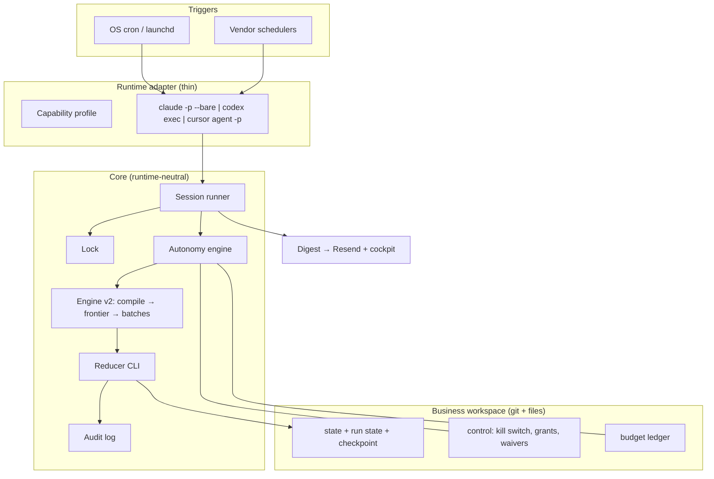
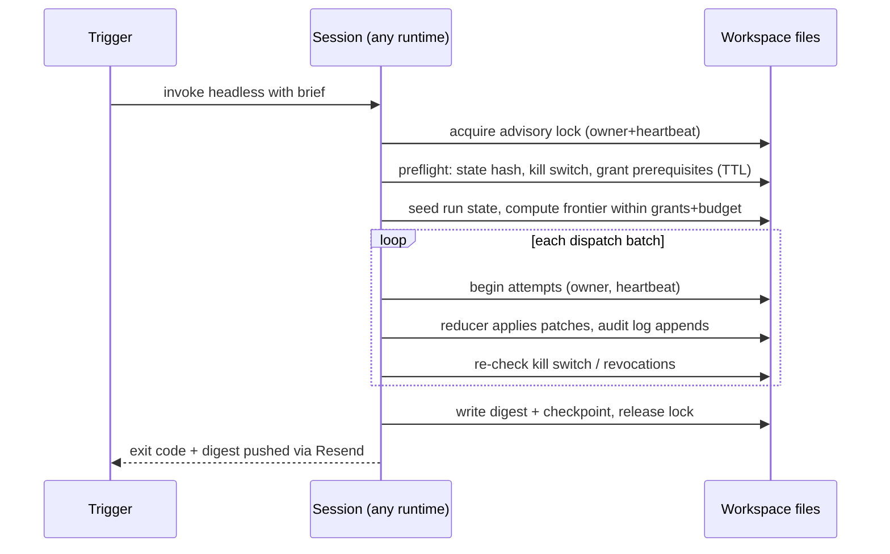
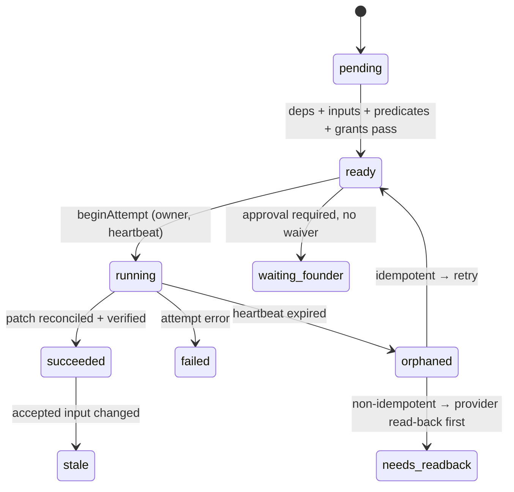
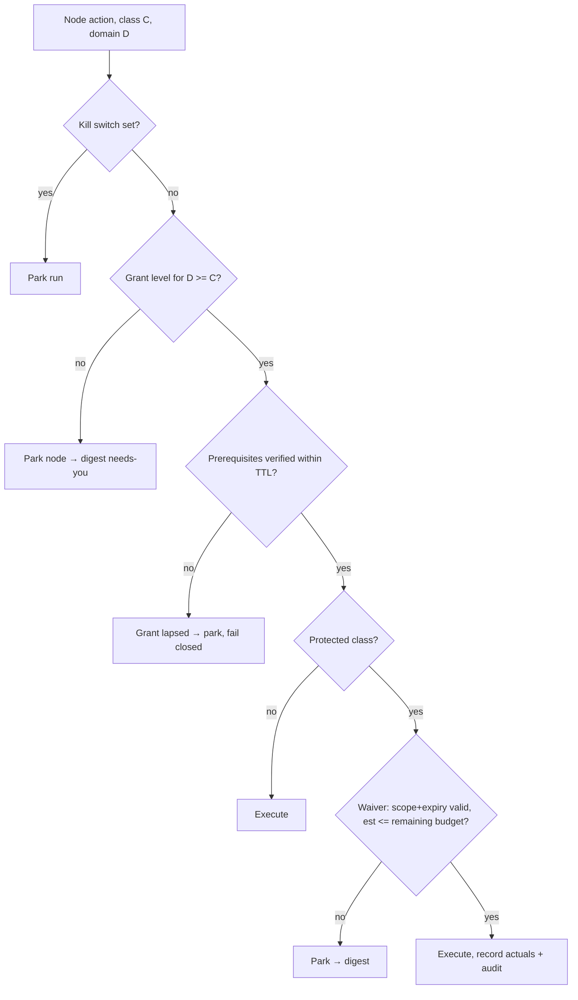

# Autonomous Business Runtime - Plan

## Goal Capsule

- **Objective:** Rebuild this repo greenfield into a runtime-neutral system that autonomously creates and manages B2C mobile app businesses through scheduled headless agent sessions, with founder-selected per-business-unit autonomy enforced by code.
- **Authority hierarchy:** Product Contract Requirements govern behavior; Key Technical Decisions govern mechanism within them; Implementation Units override neither. The v0.65.1 target architecture (`docs/history/graph-execution-adoption-2026-08-v0.65.1.md`) is inherited design input; where this plan diverges, the divergence is named in a KTD.
- **Execution profile:** Phased (A Foundations → B Sessions & Runtimes → C Content & Verification → D Rehearsal & Cutover). Core engine work is test-first against fixtures; adapter work is smoke-first against real CLIs.
- **Stop conditions:** Stop and surface to the founder if (a) a settled decision proves infeasible (e.g., a runtime cannot run headless unattended at all), (b) any change would mutate the live launched business's state before U10's rehearsal passes, or (c) cutover would delete an artifact the live business still consumes.
- **Tail ownership:** The implementing session owns branch, verification, and PR; cutover (U11) is a founder-visible release decision.

---

## Product Contract

### Summary

Turn the launch skill into an autonomous business runtime: a typed graph that actually executes, scheduled sessions that run headless on Claude Code, Codex, or Cursor against durable file state, and an autonomy model the founder configures per business unit — with prerequisites, budgets, caps, undo, and audit — instead of autonomy being prescribed in prose. Legacy dispatch surfaces and unneeded subsystems are deleted at cutover.

### Problem Frame

The 2026-08-04 audit established that the repo's graph is mechanically true only at the catalog/CI altitude: a real compiler exists, but its execution half has zero callers, the "orchestrator-owned reducer" is a role the model plays, hooks fail open, and autonomy is a single global mode plus a fixed founder-gate list an agent obeys as prose. Autonomous operation ("manage the business while the founder is away") is impossible in that shape: a cron-triggered session has no chat context, so every contract that lives as prose narration simply doesn't exist for it. Separately, autonomy today is prescribed — the skill decides what needs founder approval — rather than selected by the founder at the granularity they actually think in (per business unit, with different risk tolerance for growth vs. money vs. store).

### Requirements

**Identity and runtime**

- R1. The system creates and manages B2C mobile app businesses end to end — launch and post-launch operation — from durable file-based state; any session (interactive or scheduled, any runtime) reconstructs truth from durable state, never from chat memory.
- R2. Autonomous operation runs as externally triggered, bounded, headless sessions. No resident process: each run starts fresh, acquires state, executes, and exits. (Named reconciliation with the v0.65.1 "no long-running service" decision — scheduled sessions are that decision's compatible shape, not its reversal.)
- R3. The same session contract runs on Claude Code, Codex/ChatGPT, and Cursor. An adapter may reduce concurrency; it may never change which nodes are reachable, which approvals are required, or what verification passes (adapter-parity rule, carried from v0.65.1).
- R4. The compiled graph is the only dispatch source: readiness, ordering, resource conflicts, and approvals are computed and enforced by code. Prose never schedules work.

**Autonomy model**

- R5. The founder selects autonomy per business unit at onboarding and can change it at any time; the system ships conservative defaults but prescribes nothing. Selection follows the founder-zero conversation protocol: plain language, 2–3 choices, recommendation first, skippable.
- R6. Autonomy grants bind to stable graph domain IDs; founder-facing vocabulary (e.g., "revenue" for `domain.money`) is a copy-layer mapping, many-to-one onto domains, never a renamed ID.
- R7. A grant activates only after its prerequisites verify mechanically, and prerequisites re-verify with a TTL during runs (at minimum once per session before first use of the granted class). Examples: secrets autonomy requires live Doppler proof (`doppler me` + scoped `doppler run --` smoke + current `SECRETS.md`); spend autonomy requires a funded budget entry. Unverifiable prerequisite = lapsed grant = dependent nodes park, fail closed.
- R8. Protected gate classes — spend, credentials/access, legal/pricing, public actions, release/store submission, destructive — are waivable per business unit only by explicit founder opt-in, recorded as a typed waiver carrying scope, caps, budget period, expiry, undo contract, and audit trail. For classes without a true reversal (release/store submission, destructive), the undo contract takes its mitigation variant: an explicit irreversibility acknowledgment plus required mitigation steps.
- R9. Waiver policy is data, not code: shipped defaults mark the most dangerous actions ask-first, and the founder can deliberately change any default. No hardcoded unwaivable list. Runtime-harness safety rules (what a given agent harness refuses regardless of grants) remain a floor the autonomy system cannot override; actions above that floor are designed API-first (provider APIs with Doppler-routed keys) rather than browser-credential paths.
- R10. A durable budget ledger tracks running balances per unit and period. Spend-class nodes declare a cost estimate; dispatch hard-stops before any action whose estimate would breach the remaining budget; actuals are recorded after. Token/API cost per run is capped by the same mechanism (self-implemented circuit breaker — no vendor cap exists on the API-key path), plus a real-time ceiling for cost that accrues during execution: sessions run under the runtime CLI's max-turn/max-token flags and the runner re-checks accrued spend between dispatch batches — the estimate check gates starts; the ceiling bounds runs.
- R11. A kill switch — a durable control flag per business — halts all autonomous dispatch. It is checked at session start, before each dispatch batch, and before any protected-gate action. Grant revocation takes effect at the next dispatch boundary; in-flight non-idempotent actions complete or roll back, never abort mid-mutation.

**Execution safety**

- R12. Durable run state records owner session, heartbeat, and TTL per attempt. A node found `running` with a dead heartbeat is never blindly retried unless idempotent; non-idempotent classes (mutate/publish/spend/release/destructive) require provider read-back to establish ground truth before retry or resume.
- R13. Cross-process safety: an advisory lock with owner ID and heartbeat guards business state. A scheduled run that finds the lock held backs off and reports "did not run". Interactive priority is a cooperative yield: a scheduled run checks for a pending interactive request at each dispatch-batch boundary (the same point it checks the kill switch) and releases there; a live-heartbeat lock is never force-broken; a stale lock is breakable only with read-back verification.
- R14. All state mutation flows through a single-writer reducer CLI applying typed patches. Out-of-band writes are detectable (state hash recorded on every reducer commit) and fail preflight — which runs at session start and again before every dispatch batch, so a same-session tamper is caught before another protected action can use it.
- R15. Producer never verifies its own work, and verification exercises real capability boundaries: tests attempt forbidden actions at a given grant level and assert rejection. Generated artifacts are verified regenerate-and-diff, never hash-and-anchor (carrying the recorded rejection of self-attestation).

**Founder surface**

- R16. Every scheduled session ends by writing a digest — advanced / parked-needs-you / spend / anomalies — pushed over the founder channel (Resend email, reusing the existing narrative content model), plus the rendered cockpit. Parked founder-gates re-present on cadence through the digest; a digest mention does not re-date a gate — only a founder response does.
- R17. Onboarding, the autonomy console, and all founder-facing surfaces speak founder vocabulary; internal IDs, statuses, and class names never leak (carrying the existing founder-copy gate).

**Rebuild and repository**

- R18. The rebuild is greenfield within this repo: a new core built beside the old tree; existing content — knowledge, validators, starters, workspace templates — ports only where it earns its place against the new architecture.
- R19. Cutover means deletion: legacy dispatch surfaces (SKILL.md orchestration prose, Claude-only hook enforcement, the prose runtime-routing contract) and culled subsystems are removed, not deprecated in place.
- R20. Generated routing/documentation derives from the graph (graph → prose). The current inversion — catalog scraping hand-authored README load-when tables — is eliminated; load conditions become catalog data.

### Scope Boundaries

- **Deferred to follow-up work:** portfolio index/dashboard across businesses (per-business core ships first; the registry file format is designed for it — KTD12); behavioral-eval CI expansion (blocked on an Anthropic API key); Cursor rich structured-output support (profile ships with degrade path — its JSON output mode is undocumented as of Aug 2026); multi-founder/team operation.
- **Outside this product's identity:** a SaaS/dashboard product, an MCP server product, a second skill or router split (settled twice: 2026-06-05, 2026-07-30), a resident daemon or graph database.

### Success Criteria

- A business advances measurably (nodes accepted, artifacts produced, digests sent) across ≥3 consecutive scheduled sessions with no interactive session between them, on ≥2 different runtimes against the same workspace.
- A run at any grant level provably cannot exceed it: the capability-boundary suite attempts each protected-gate class without a waiver and every attempt is rejected with a recorded reason.
- A founder can go from empty directory to configured, scheduled business in one onboarding conversation.

---

## Planning Contract

### Key Technical Decisions

- KTD1. **Scheduled sessions are externally triggered headless CLI runs.** OS cron/launchd (or any vendor scheduler — Claude routines, ChatGPT automations, Cursor automations — as interchangeable triggers) invokes a runtime adapter that runs `claude -p --bare`, `codex exec`, or `cursor agent -p` with a session brief passed as a file, never a CLI argument (argv is visible in process listings); the session acquires the lock, runs bounded work under a wall-clock cap, exits. (session-settled: user-directed — chosen over resident service and session-only; constraint: must work equivalently on Claude Code, Codex/ChatGPT, and Cursor.) Governs R2, R3.
- KTD2. **State substrate is git plus schema-versioned JSON/YAML files in the business workspace.** Checkpoint files are written temp-then-rename; run state, control file, grants, ledger, and audit log live beside `PROJECT_STATE`'s successor. Rationale: Aug-2026 research confirms no vendor state format is shared across the three runtimes — git + files + `AGENTS.md` is the only common substrate; vendor caps don't apply on the API-key path, so budget enforcement must be self-implemented (R10). Governs R1.
- KTD3. **Grants bind to domain IDs; business units are a copy-layer grouping.** Domains (~14) are the finest stable grouping with knowledge routing attached; lanes (22) are too fine for founder choices, areas (6) too coarse. A business-unit selection writes the same level to its member domains. Shipped grouping: Product ← research, product, experience, words; Design ← design; Engineering ← engineering; Growth ← growth; Analytics ← data; Revenue ← money; Store ← store; Trust ← trust; Operations ← operations. System domains (process, orchestration) are runtime machinery, never founder-grantable. Each unit offers three plain-language levels mapping to action-class ceilings: review-first (ceiling draft), run-with-guardrails (ceiling mutate/publish; protected classes still gated), full (ceiling destructive; protected classes activate only through their waivers). Governs R6.
- KTD4. **The waiver/envelope schema extends the existing gate-ledger 2.0.0 and action-class vocabulary** (`gateClass`, `bypassPolicy`, option/consequence structure; `observe/draft/mutate/publish/spend/release/destructive`) with the missing axes: per-domain scope, caps, budget period, expiry, undo contract. R8's six protected classes enter the schema as a protected-category tag layered onto the action classes (spend→spend, release/store submission→release, destructive→destructive; credentials/access, legal/pricing, and public actions tag the mutate/publish actions touching those resources), not as new gateClass values. One taxonomy — the informal `active_gate_class` strings and free-text `founderOnlyActions` are replaced, not paralleled. The change from "protected gates never bypassable" to "waivable with explicit opt-in" supersedes the contrary lines in the legacy contracts and is recorded as such. (session-settled: user-directed — chosen over non-waivable hard floors: founder selects the ceiling, with caps/budgets/undo/audit as the safety substitute.) Governs R8, R9.
- KTD5. **Budget ledger, kill switch, and prerequisite probes are files and checks in the dispatch path.** `computeFrontier` consults grants, waivers, prerequisite freshness, remaining budget, and the control flag as code; a spend node without a declared estimate does not compile. Governs R7, R10, R11.
- KTD6. **Engine v2 ports the compiler's proven concepts and adds the missing run half.** Carried: typed catalog, resource-claim conflict serialization (prefix-aware), fail-closed joins, input fingerprints, staleness invalidation, the v0.65.1 resource model and 17 acceptance criteria. Added: one status vocabulary shared by business state and run nodes (the lane-status/RunNodeStatus split dies), persistence + resume + seeding from live state, per-attempt owner/heartbeat/TTL, and a session-level wall-clock cap enforced independently of heartbeats — carrying v0.65.1's timeout-and-cancellation capability forward; an exceeded cap writes a distinct timed-out digest entry. The catalog is also the single authority for generated routing docs. Governs R4, R12, R20.
- KTD7. **A reducer CLI is the single writer, with a hash-chained audit log, and sessions cannot reach around it.** Workers and sessions produce typed patches; the reducer validates, applies transactionally, records a state hash, and appends an audit entry hash-chained to its predecessor (verification recomputes the chain, never byte-diffs). The session's own tool surface excludes direct writes to control/grants/waivers/ledger/audit paths — enforced by the adapter's capability profile (tool allowlist) with OS file permissions as the second layer — so the reducer's typed-patch interface is the only mutation path reachable from inside a run; per-batch preflight is the detection backstop, not the enforcement. Governs R13, R14.
- KTD8. **Runtime adapters are capability profiles plus entrypoint documents, not editor hooks.** One canonical `AGENTS.md` per generated surface with thin per-runtime addenda (a Cursor entrypoint is created — it has zero surface today); enforcement lives in the reducer and validators, which run identically everywhere, replacing the Claude-only PostToolUse hook mechanism. Unattended auth honors its own rationale end to end: the runtime CLI's own key and all business secrets are injected at session start from Doppler service tokens whose scope derives from the run's active grants (least privilege per session) — never bare long-lived env vars sitting in the process environment while the session ingests repo- and web-sourced content (the recorded Codex warning). Governs R3, R15.
- KTD9. **Digest pushes over the existing Resend integration** using the narrative content model already in state; the cockpit remains the pull surface. Governs R16.
- KTD10. **Verification ports the four proven patterns** — renderer + `--check` drift gate, single-source audit plan + parity enforcement, fixture-driven validator harness, shared contract module round-trip — and adds capability-boundary tests (attempt-and-assert-rejected) and cross-runtime parity tests (same scenario, each capability profile: dispatch may differ in concurrency only). Governs R15.
- KTD11. **Cull list is evidence-driven against the consumer map.** Deleted at cutover: SKILL.md orchestration prose (becomes a thin router), the hook enforcement path (`install-hooks`, `hook-contract`, PostToolUse settings), the prose runtime-routing contract, the skill-root `design-system/` token triplication (consumers repoint to the generated projection), dead engine code superseded by v2, LaunchBench scenarios that only grade text (superseded by capability tests; mechanical ones port). Survives: studio (design/control-plane substrate, heavily consumed), starters (validator-consumed), `agents/openai.yaml` (gains a validator instead of deletion). (session-settled: user-directed — aggressive cull chosen over dead-code-only.) Governs R19.
- KTD12. **The business workspace stays the unit of state and scheduling; portfolio is a registry file.** One workspace = one business = one schedule + control file. A slug-keyed registry (formalizing `PORTFOLIO_REGISTRY.md` with the existing loud-fail aggregation pattern) makes the portfolio index a later, read-only layer. Governs R1; scope boundary above.
- KTD13. **Greenfield lands beside the old tree, in this repo.** New top-level directories under the skill root; the old tree keeps working until U10's rehearsal passes; U11 cuts over and deletes. The recorded directory-move trap list travels with U11 as an execution checklist. (session-settled: user-directed — literal greenfield chosen over migrate-in-place.) Governs R18, R19.

### High-Level Technical Design

**System topology**



**Scheduled session lifecycle**



**Run-node lifecycle (v2 additions in bold)**



**Autonomy decision per action**



### Sequencing

Phase A (U1–U4) builds the core against fixtures only. Phase B (U5–U7) makes it run scheduled and cross-runtime. Phase C (U8–U9) ports content and builds the verification harness; U8 needs only U2, so its Phase C grouping is thematic, not a gate — it may run alongside Phase B. Phase D (U10–U11) rehearses on a fixture business plus a read-only shadow of the live business, then cuts over and culls. The live launched business (Ocho) is never mutated before U10 passes.

---

## Output Structure

New tree beside the old, under `skill/b2c-mobile-business-launch/`:

```text
core/
  schema/          # JSON Schemas + TS types: state v2, grants, waivers, ledger, control, run state, checkpoint
  engine/          # catalog compile, frontier, dispatch, staleness, resource claims
  reducer/         # single-writer CLI, patch protocol, state hash, audit append
  autonomy/        # grant evaluation, prerequisite verifiers, waivers, budget, kill switch
  session/         # scheduled-session runner, digest composer (lock lives in core/reducer/ per U3)
  adapters/        # capability profiles + installers (claude, codex, cursor, inline; templates live in workspace-template/)
catalog/           # definition graph as data: domains, lanes, workflows, gates, load-when
content/           # ported knowledge (earns-its-place), keyed by catalog reference IDs
workspace-template/ # business workspace v2 (state, control, AGENTS.md + addenda, SECRETS.md, ...)
verification/      # fixtures, capability-boundary tests, parity tests, validators, audit plan
```

`studio/`, `starters/`, `tooling/` renderers survive and repoint; the tree above is a scope declaration — the implementer may adjust layout if implementation reveals better.

---

## Implementation Units

| U-ID | Title | Key files | Depends on |
|---|---|---|---|
| U1 | Core schemas + one status vocabulary | `core/schema/` | — |
| U2 | Engine v2 with durable, resumable runs | `core/engine/` | U1 |
| U3 | Reducer CLI, audit log, lock | `core/reducer/` | U1 |
| U4 | Autonomy engine | `core/autonomy/` | U1–U3 |
| U5 | Scheduled-session runner + digest | `core/session/` | U2–U4 |
| U6 | Runtime adapters + scheduler install | `core/adapters/` | U5 |
| U7 | Onboarding + autonomy console | `content/`, cockpit v2 | U4, U5 |
| U8 | Catalog + content port triage | `catalog/`, `content/` | U2 |
| U9 | Verification harness | `verification/` | U4–U6 |
| U10 | Rehearsal: fixture + shadow business, ≥2 runtimes | `verification/` | U6–U9 |
| U11 | Cutover + cull | repo-wide | U10 |

### U1. Core schemas and one status vocabulary

- **Goal:** Define every durable file's schema — business state v2, autonomy grants, waivers, budget ledger, control file, run state, checkpoint — with a single node/lane status vocabulary shared end to end.
- **Requirements:** R6, R8, R10, R11, R12 (schema side), R14.
- **Files:** `core/schema/*.schema.json`, `core/schema/types.ts`, `core/schema/index.ts`; tests in `verification/fixtures/schema.fixtures.ts`.
- **Approach:** Extend the gate-ledger 2.0.0 shapes per KTD4; every schema carries `schemaVersion`; port the migrator pattern from `tooling/migrate-founder-gates.ts` (migrations demote to re-present, never auto-approve).
- **Execution note:** Test-first: fixture files for every schema, valid and invalid, before types.
- **Test scenarios:**
  - Valid grant/waiver/ledger/control documents validate; each missing-required-axis case (waiver without expiry, spend grant without budget ref, cap without period) rejects with a named error.
  - A v1 `PROJECT_STATE.yaml` migrates to state v2 with every founder gate demoted to re-present, never auto-approved.
  - Status vocabulary round-trips: no v1 lane status maps ambiguously.
  - A destructive or release-class waiver validates only with a literal undo or the mitigation variant (irreversibility acknowledgment + steps); neither → reject.
- **Verification:** Schema fixtures pass; migration of the live business's real state file (copy, read-only) produces a valid v2 document.

### U2. Engine v2 with durable, resumable runs

- **Goal:** A compiler and scheduler whose run state persists, resumes, and seeds from live business state — the audit's "engine with no callers" gap closed by construction.
- **Requirements:** R4, R12; KTD6.
- **Files:** `core/engine/compile.ts`, `core/engine/frontier.ts`, `core/engine/dispatch.ts`, `core/engine/runstate.ts`; tests in `verification/fixtures/engine.fixtures.ts`.
- **Approach:** Port resource-claim conflict logic and fail-closed joins from the existing `runtime/graph/execution.ts`; add persistence (checkpoint file, temp-then-rename), resume, seeding from state v2, and per-attempt owner/heartbeat/TTL. Frontier consults the autonomy engine (U4 interface defined here, stubbed).
- **Execution note:** Test-first; every scheduler property from the v0.65.1 acceptance criteria that survives into v2 gets a fixture.
- **Test scenarios:**
  - A run interrupted after `beginAttempt` resumes: idempotent node re-dispatches; non-idempotent node lands in `needs_readback`, never auto-retries.
  - Seeding from a mid-launch state v2 file yields a frontier that excludes completed work (no "day one only" regression).
  - Two nodes claiming `resource.path.foo` and `resource.path.foo.bar` serialize; declared-output omission fails the join closed.
  - Stale propagation: changing an accepted input invalidates descendants transitively.
- **Verification:** Engine fixtures pass; a compiled plan from the shadow business's real state is manually spot-checked for sane frontier membership.

### U3. Reducer CLI, audit log, and lock

- **Goal:** The single writer exists as code: typed patches in, transactional state out, append-only audit, advisory lock, out-of-band write detection.
- **Requirements:** R13, R14.
- **Files:** `core/reducer/cli.ts`, `core/reducer/patch.ts`, `core/reducer/audit.ts`, `core/reducer/lock.ts`; tests in `verification/fixtures/reducer.fixtures.ts`.
- **Approach:** Patch protocol from the existing `StatePatch` type; state hash recorded per commit; audit entries hash-chained (each stores a hash of previous-hash + content); lock is owner ID + heartbeat timestamp adjacent to state — interactive priority via cooperative yield at batch boundaries per R13, stale-break only with read-back flag.
- **Test scenarios:**
  - A patch omitting a declared output is rejected (ported fail-closed join at the reducer boundary).
  - Out-of-band edit between commits fails the next preflight with a named error.
  - Lock contention: second process backs off and reports "did not run"; a stale lock breaks only with the read-back flag; heartbeat refresh prevents false stale.
  - Audit chain verification fails when a historical entry is mutated (fixture rewrites an entry, asserts chain break), alongside the append-only test.
  - An interactive request during a live scheduled run acquires the lock at the next batch boundary, never mid-attempt.
- **Verification:** Reducer fixtures pass; a simulated concurrent interactive+scheduled write test shows no last-writer-wins loss.

### U4. Autonomy engine

- **Goal:** Grants, prerequisites, waivers, budgets, and the kill switch evaluated in the dispatch path — autonomy as code.
- **Requirements:** R5–R11; KTD3, KTD4, KTD5.
- **Files:** `core/autonomy/grants.ts`, `core/autonomy/prerequisites.ts`, `core/autonomy/waivers.ts`, `core/autonomy/budget.ts`, `core/autonomy/killswitch.ts`; tests in `verification/boundaries/`.
- **Approach:** Grant map keyed by domain ID with founder-unit copy mapping as catalog data; prerequisite verifiers are pluggable probes (Doppler: `doppler me` + scoped `doppler run --` smoke + `SECRETS.md` freshness; budget: funded ledger entry) cached per session with TTL, fail closed; waiver evaluation per the KTD4 schema; budget check compares declared estimate to remaining balance before dispatch.
- **Execution note:** Test-first; the boundary suite here is the plan's central safety deliverable.
- **Test scenarios:** Per domain × action class:
  - In-scope action at sufficient grant executes and records envelope + ledger evidence.
  - Action above grant level parks with recorded reason; protected-class action with no waiver parks even at maximum grant.
  - Waiver expired / scope-mismatched / estimate-over-budget each block before execution.
  - Prerequisite lapse mid-session (revoked Doppler token simulated) parks all dependent nodes, not just the failing one.
  - Kill switch set mid-run: next batch does not dispatch; revocation takes effect at batch boundary.
  - A session process attempting a direct write to control/grants/ledger/audit paths is blocked by the adapter tool allowlist, and per-batch preflight catches any that slip through before the next dispatch.
- **Verification:** Every protected-gate class has at least one attempt-and-rejected test; `npm run audit` (v2) includes the boundary suite.

### U5. Scheduled-session runner and digest

- **Goal:** The bounded headless session: acquire, preflight, execute within grants, digest, exit — identical logic on every runtime.
- **Requirements:** R1, R2, R16.
- **Files:** `core/session/run.ts`, `core/session/digest.ts`, `core/session/brief.ts`; tests in `verification/fixtures/session.fixtures.ts`.
- **Approach:** The runner is a CLI the runtime adapter invokes; digest composer reuses the narrative content model and sends via Resend with the cockpit as pull surface; all exit paths — normal completion, lock back-off, kill switch, preflight failure, wall-clock timeout — route through the digest writer, so a no-op or failed run still writes a digest ("parked, needs you" vs. silence). Anomalies content covers budget rejections, kill-switch triggers, prerequisite lapses, tamper detection, and orphaned-run detection. Parked-gate re-presentation cadence tracked in state; founder response, not digest mention, re-dates.
- **Test scenarios:**
  - A session with all nodes gated exits cleanly with a "parked" digest, not silence.
  - Digest content: advanced/parked/spend/anomalies sections populated from run state, founder vocabulary only (founder-copy gate applies).
  - A preflight failure (state-hash mismatch) produces an anomalies digest entry and a non-zero exit — never a silent log-only death.
  - A run exceeding its wall-clock cap writes a timed-out digest entry.
  - Crash before digest: next session detects the orphaned run and reports it in its own digest.
- **Verification:** Session fixtures pass; one real Resend send to the founder address from a fixture run.

### U6. Runtime adapters and scheduler install

- **Goal:** Claude Code, Codex, and Cursor each invoke the same session runner headless; schedules install via OS cron/launchd with vendor schedulers documented as alternates.
- **Requirements:** R3; KTD1, KTD8.
- **Files:** `core/adapters/claude.ts`, `core/adapters/codex.ts`, `core/adapters/cursor.ts`, `core/adapters/inline.ts`, `core/adapters/install-schedule.ts`, `core/adapters/install-entrypoints.ts` (writes/refreshes `AGENTS.md` + addenda and removes v1 hook entries in a target repo — the tool U11's live-repo refresh depends on); entrypoint templates in `workspace-template/`.
- **Approach:** Capability profiles (concurrency, structured-output support, sandbox flags) per the Aug-2026 CLI research: `claude -p --bare` with `ANTHROPIC_API_KEY`; `codex exec` with `CODEX_API_KEY` and sandbox tier; `cursor agent -p` with `CURSOR_API_KEY` and a degrade path while its JSON output is undocumented. Secrets via Doppler service tokens scoped per run; no broad keys in env where untrusted content is processed. A Cursor entrypoint addendum is created (none exists today). The `inline` profile is the test/fixture execution shape used by fixture suites and rehearsal dry-runs, not a founder-facing runtime — the three-runtime parity criteria exclude it. Capability profiles carry the tool allowlist excluding direct writes to autonomy/control paths (KTD7).
- **Execution note:** Smoke-first — a real headless invocation per runtime against a fixture workspace before any deeper work.
- **Test scenarios:**
  - Same fixture scenario through each capability profile: identical node reachability and approval requirements; only concurrency/mode differ (parity test).
  - Auth-expiry simulation: adapter reports a named auth failure into the digest rather than a silent no-op.
  - `install-schedule` writes a correct crontab/launchd entry and an uninstall reverses it.
- **Verification:** Three real headless smoke runs (one per runtime) complete against the fixture business on the maintainer machine.

### U7. Onboarding and autonomy console

- **Goal:** The founder configures per-unit autonomy in one guided conversation and can see and change grants, budgets, waivers, and parked items afterward.
- **Requirements:** R5, R16 (console view), R17.
- **Files:** `content/onboarding/` (conversation protocol as catalog-driven content), cockpit v2 additions in `studio/` render path.
- **Approach:** Reuse the founder-zero conversation shape (2–3 choices, recommendation first, defaults accepted in bulk); autonomy console is a cockpit v2 panel rendering grants/waivers/ledger/parked from state (read model), edits flow through the reducer.
- **Test scenarios:**
  - Onboarding with all defaults accepted yields a valid, conservative grant map.
  - Copy gate: no internal vocabulary in any onboarding or console string.
  - A waiver opt-in flow records the full envelope (scope, cap, period, expiry, undo note) or refuses to activate.
- **Verification:** Founder-copy validator passes on all new surfaces; a scripted onboarding transcript produces the expected control file.

### U8. Catalog and content port triage

- **Goal:** The definition graph becomes data (domains, lanes, workflows, gates, load-when), and existing knowledge/validators port only where they earn their place.
- **Requirements:** R18, R20.
- **Files:** `catalog/*.ts` or `catalog/*.yaml`, `content/<domain>/`, port ledger at `docs/plans/attachments/2026-08-port-ledger.md`.
- **Approach:** Load-when conditions move from README prose into catalog reference entries (un-inverting authority per R20); generated routing docs render from catalog with `--check` drift gates. Validators triage: port the on-disk-proof minority and domain gates wired to graph nodes; drop word-pattern validators superseded by capability tests; record every keep/drop with a reason in the port ledger.
- **Test scenarios:**
  - Catalog structural validation: no dangling IDs, no cycles, every content file reachable from a reference entry (ported gate).
  - Generated routing doc drift fails `--check`.
  - Port ledger completeness: every v1 validator and knowledge file appears exactly once (kept/dropped/merged with reason).
- **Verification:** `npm run audit` (v2) passes with catalog gates active; port ledger reviewed in PR.

### U9. Verification harness

- **Goal:** The v2 audit: fixture suites, capability-boundary tests, parity tests, drift gates, and probes as prerequisite checks, under one audit plan with parity enforcement.
- **Requirements:** R15; KTD10.
- **Files:** `verification/audit-plan.ts`, `verification/run-audit.ts`, `verification/fixtures/_harness.ts`, `verification/boundaries/`, `verification/parity/`.
- **Approach:** Port the audit-plan single-source pattern, the fixture harness, and the contract-module round-trip pattern; LaunchBench scenarios that are mechanically checkable port as fixtures; text-grading scenarios are dropped with reasons in the port ledger; live probes (Doppler, PostHog, RevenueCat) wire in as prerequisite verifiers with recorded, fingerprinted results.
- **Test scenarios:**
  - Audit-plan parity: a `check:*` script not in the plan fails the parity check.
  - The harness runs each validator against pass and fail fixture repos, asserting issue codes, not just exit codes (recorded trap).
  - Boundary and parity suites from U4/U6 registered and green.
- **Verification:** Full v2 audit green in CI on the greenfield tree while the legacy tree still passes its own.

### U10. Rehearsal on fixture and shadow business

- **Goal:** Prove the whole loop before cutover: scheduled sessions advance a fixture business across runtimes, and a read-only shadow of the live business compiles, seeds, and plans sanely.
- **Requirements:** R1–R3, R12, R13; success criteria.
- **Files:** `verification/rehearsal/`; no live-business writes.
- **Approach:** Fixture business runs ≥3 consecutive scheduled sessions (≥2 runtimes) unattended, digests verified; shadow = copy of the live business's state migrated (U1) and compiled (U2), frontier reviewed by the founder in the digest format. Kill switch and lock exercised live (interactive session opened mid-scheduled-run).
- **Test scenarios:**
  - Three-session unattended advance with a founder-gate parked in session 2 and re-presented in session 3's digest.
  - Mid-run kill switch halts the next batch; digest reports it.
  - Cross-runtime handoff: session 1 on Claude, session 2 on Codex, no state corruption, orphan detection works.
- **Verification:** Rehearsal checklist complete with recorded evidence; founder reviews the shadow-business frontier digest before U11 proceeds.

### U11. Cutover and cull

- **Goal:** The greenfield tree becomes the system; legacy dispatch surfaces and culled subsystems are deleted; docs regenerate from the graph.
- **Requirements:** R19, R20; KTD11, KTD13.
- **Files:** repo-wide deletions per KTD11; `SKILL.md` rewritten as thin router; `docs/architecture.md` regenerated; `skill-version.json` major bump.
- **Approach:** Execute the cull list; repoint design-token consumers to the generated projection and delete the skill-root copy; migrate the live business's workspace with U1's migrator (founder-approved moment); carry the recorded directory-move trap list as the execution checklist (globs covering zero files, path-segment vs identifier renames, gitignored dir names, fixture exit-code vs issue-code assertions, `git status` ground truth before trusting sweeps).
- **Test scenarios:**
  - Post-cutover audit green; no reference to a deleted path anywhere (link audit).
  - Legacy engine, hooks, and prose-contract removal leaves zero orphaned npm scripts (parity check catches).
  - The live business's migrated workspace passes state validation and one supervised scheduled session.
  - The live business's app repo receives the v2 entrypoint refresh (old hook entries removed, new `AGENTS.md` + addenda installed) and its validators pass against the refreshed contract.
- **Verification:** Full audit + link audit green post-deletion; one supervised scheduled session on the live business completes with a correct digest; version bumped, runtime copy synced and verified from a clean worktree.

---

## Verification Contract

| Gate | Command (v2) | Proves | Applies to |
|---|---|---|---|
| Schema fixtures | `npm run test:fixtures -- schema` | Every durable file's contract | U1 |
| Engine fixtures | `npm run test:fixtures -- engine` | Resume, seeding, staleness, conflicts | U2 |
| Reducer fixtures | `npm run test:fixtures -- reducer` | Single writer, lock, audit-chain integrity | U3 |
| Session fixtures | `npm run test:fixtures -- session` | Bounded headless session, digest on every exit path, orphan detection | U5 |
| Capability boundaries | `npm run test:boundaries` | Grants/waivers/budget/kill switch cannot be exceeded | U4, U9 |
| Runtime parity | `npm run test:parity` | Reachability/approvals identical across profiles | U6, U9 |
| Full audit | `npm run audit` | Everything registered, parity-enforced | all |
| Rehearsal | `verification/rehearsal/` checklist | Unattended multi-session, multi-runtime advance | U10 |

Boundary tests attempt the forbidden action and assert rejection with a recorded reason — never grade guardrail text (R15).

## Definition of Done

- All Verification Contract gates green in CI; rehearsal evidence recorded.
- Success criteria met: 3-session unattended advance on 2 runtimes; every protected-gate class attempt-rejected without waiver; one-conversation onboarding produces a valid grant map.
- Cutover complete: legacy dispatch surfaces deleted, port ledger accounts for every v1 validator and knowledge file, link audit green.
- Live business migrated and one supervised scheduled session completed with founder-reviewed digest.
- Abandoned-attempt code from the greenfield build is removed; the port ledger contains no "TBD" rows.

---

## System-Wide Impact

- **Generated app repos (live surface):** the launched business's app repo carries v1 entrypoints — `AGENTS.md`, `CLAUDE.md` pointer, and PostToolUse hook `settings.json` — whose installer and contract module U11 deletes. Cutover must ship a v2 entrypoint refresh for existing app repos (new `AGENTS.md` + addenda, hook entries removed or replaced by the runtime-neutral validator path), applied in the same supervised session as the workspace migration (U11 scenario added).
- **Public artifact contract:** the `workspace/business/*` root layout is consumed by existing launches and their gates; the v2 workspace template is a versioned product migration with U1's migrator, never a silent path move.
- **Installed runtime copy:** the skill runs from an installed copy; U11's version bump must sync it (verify from a clean worktree — recorded practice), or live sessions keep executing the deleted architecture.
- **Studio read model:** the Business Control workspace projection reads `business.json` + state; state v2 changes its inputs, so the projection schema and its `--check` gate update in U7, not post-hoc.

---

## Risks & Dependencies

- **Vendor CLI churn** (highest): Cursor's headless surface is beta ("trusted environments only") with undocumented JSON output; Codex flags and Claude bare-mode semantics moved within 2026. Mitigation: capability profiles isolate vendor surface to one file each; parity tests catch semantic drift; refresh CLI docs before U6 (source-freshness discipline).
- **Unattended auth expiry:** env-key auth can lapse silently. Mitigation: adapter preflight verifies auth and reports named failures into the digest (U6 scenario).
- **Secret exposure in unattended runs:** recorded Codex warning about job-level keys near repo-controlled content. Mitigation: KTD8's Doppler service-token scoping; quarantine rules for untrusted content port from the existing frontier-operations contract.
- **Greenfield re-hardening risk:** months of Codex-review hardening live in v1 validators and LaunchBench. Mitigation: the port ledger forces an explicit keep/drop decision per item; mechanical scenarios port as fixtures.
- **Live business safety:** Ocho is in production. Mitigation: read-only shadow until U10 passes; migration and first scheduled session are supervised, founder-approved moments (stop condition in the Goal Capsule).
- **Dependency:** Resend account (exists, wired); Doppler workplace (exists); scheduler host = maintainer machine for cron/launchd (machine-on constraint) with vendor cloud schedulers as alternates.

## Open Questions

- Deferred: when Cursor documents structured output, upgrade its profile from the degrade path (non-blocking; U6 ships with degrade).
- Deferred: portfolio index timing — after the first multi-business month proves the registry format (non-blocking; KTD12).
- Deferred: behavioral-eval cadence once an Anthropic API key is provisioned (non-blocking; recorded limitation carried from v1).
- Deferred: a real-time escalation channel for anomalies mid-run, beyond the end-of-session digest (non-blocking; fail-closed parking bounds the damage of delayed notice).
- Deferred: retention/deletion policy for audit-log and run-state history as a business ages (non-blocking; becomes material if waived-action evidence ever includes user data).

## Sources & Research

- Audit (this session, 2026-08-04): engine-without-callers, reducer-as-prose, hook fail-open, status-vocabulary split, authority inversion — the gap list this plan closes.
- `docs/history/graph-execution-adoption-2026-08-v0.65.1.md`: inherited target architecture, resource model, adapter-parity rule, acceptance criteria, "no daemon" decision (reconciled in R2/KTD1).
- `knowledge/operations/frontier-agent-operations.md` + `workspace/business/operations/business-access.schema.json`: action classes and gate-ledger 2.0.0 — the vocabulary KTD4 extends.
- `knowledge/operations/secrets-management.md` + LaunchBench Doppler scenarios: the prerequisite-probe design and its five recorded failure modes.
- `docs/history/simplification-remaining-work-2026-07-v0.60.0.md`: self-attestation rejection (R15); directory-move trap list (U11 checklist).
- Aug-2026 vendor research: `claude -p --bare` / routines; `codex exec` / automations and the job-level-key warning; `cursor agent -p` / automations beta; git+checkpoint-file convergence for portable state; self-implemented budget circuit breakers (KTD2, KTD5, KTD8, U6).
